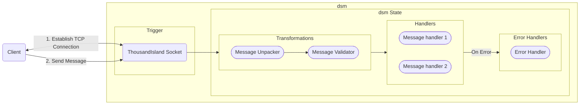

# dsm

*dsm* is an abstraction library that helps you model sequential and branched execution paths in your code as Finite State Machines in a declarative manner.

*dsm* structures message transformations, message handling and error handling into consistent pipelines, providing a single source of truth for all possible execution paths in your code, helping you build and maintain large projects.

*dsm* runs at compile time, emitting code that runs your pipelines, ensuring zero unexpected behaviour as a result of using *dsm*. Your integration tests work without any changes!

# Architecture

The following diagram shows a high level overview of the phases that encompass a *dsm* and how you can model network interactions using *dsm*.



## Components

## Context

Context is wrapper struct that stores the current state of the state machine and other metadata provided in the *dsm* definition.

## Trigger

A double arity function `trigger/2` is generated from the *dsm* defintion. This is the entrypoint into the state machine. It takes the *context*, user provided input and runs the state machine.

## State

Each state has 2 phases that are executed sequentially, the Transformations phase and the Handlers phase, and an optional error handler phase.

### Transformations

A state can define a pipeline of transformations that are executed sequentially on the incoming data. The output of each function defined in this phase is piped into the other subsequent functions in the pipeline and the final output of this phase would be the input for any handlers defined.

### Handlers

A Handler is a 2 or 3 element Tuple that defines a match criteria and an executor function that runs on the user input (or the output of Transformations) when the match criteria is met and an optional state transition when the handler is executed successfully. The first 2 elements of the Tuple must be named functions.

A state can define **either** of the following:

1. A pipeline of handlers
   - In this case the output of the transformations phase is passed through the first handler defined and its output is piped into the subsequent handlers defined while checking against the validity criteria.
   - All the handlers defined in the pipeline must execute successfully for the pipeline execution to be considered successful.
2. A list of *any match handlers*
   - In this case the output of the transformations phase is sequentially checked against ALL the handlers defined. Any handler with a valid matching criteria will be executed.

### Error Handlers

An Error Handler pipeline can be defined when a pipeline of message handlers is also defined. The shape of the error handler entry is same as that of the message handler entry, a 2 or 3 element Tuple.

When the output of any handler in the message handler pipeline does not match against the subsequent handlers match criteria, the control flow is swithced to the Error handler pipeline. The output is matched against the matchers defined in the Error handler pipeline and a matching Error Handler is executed.

## Installation

If [available in Hex](https://hex.pm/docs/publish), the package can be installed
by adding `dsm` to your list of dependencies in `mix.exs`:

```elixir
def deps do
  [
    {:dsm, "~> 0.1.0"}
  ]
end
```

Documentation can be generated with [ExDoc](https://github.com/elixir-lang/ex_doc)
and published on [HexDocs](https://hexdocs.pm). Once published, the docs can
be found at <https://hexdocs.pm/dsm>.