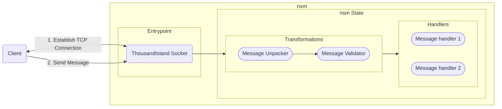

# nsm

*nsm* stands for Networking as State Machines.

*nsm* models TCP interactions as declarative Finite State Machines, where handlers are defined per event and composed through pattern matching and pipelines.

*nsm* structures message transformations, message handling and error handling into consistent pipelines, replacing ad-hoc networking code with a clear, state-driven architecture for building scalable and maintainable network applications.

# Usage

The following diagram shows a high level overview of the phases that encompass an *nsm*.



Each *nsm* must define an Entrypoint and the states of the state machine.

## Entrypoint

This defines the connection establishing logic and the initial memory state of the state machine. Though *nsm* is designed keeping networking applications in mind, it could be used in other scenarios as well, this *entrypoint* phase allows for extending *nsm* to other applications.

## State

Each state has 2 phases that are executed sequentially, the Transformations phase and the Handlers phase.

### Transformations

A state can define a pipeline of transformations that are executed sequentially on the incoming data. The output of each function defined in this phase is piped into the other functions defined in this phase and the final output of this phase would be the input for any handlers defined.

### Handlers

A state can define **either** of the following:

1. A pipeline of handlers
   - In this case the output of the transformations phase is passed through the first handler defined and its output is piped into the subsequent handlers defined while pattern matching against the validity criteria.
   - All the handlers defined in the pipeline must execute successfully for the pipeline execution to be deemed successful.
2. A list of any match handlers
   - In this case the output of the transformations phase is sequentially pattern matched against ALL the handlers defined. Any handler with a valid matching criteria will be executed.


## Installation

If [available in Hex](https://hex.pm/docs/publish), the package can be installed
by adding `nsm` to your list of dependencies in `mix.exs`:

```elixir
def deps do
  [
    {:nsm, "~> 0.1.0"}
  ]
end
```

Documentation can be generated with [ExDoc](https://github.com/elixir-lang/ex_doc)
and published on [HexDocs](https://hexdocs.pm). Once published, the docs can
be found at <https://hexdocs.pm/nsm>.

