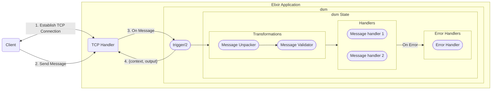

```mermaid
---
config:
    layout: dagre
    theme: mc
    title: DSM Phases
---
flowchart LR
    C(Client)

    subgraph E["Elixir Application"]
        S(TCP Handler)
    
        subgraph dsm
            direction LR
            T@{shape: "stadium", label: "trigger/2"}

            subgraph State["dsm State"]
                subgraph Transformations
                    direction LR
                    U@{shape: "stadium", label: "Message Unpacker"}
                    V@{shape: "stadium", label: "Message Validator"}
                    
                end

                subgraph Handlers
                    direction LR
                    H@{shape: "stadium", label: "Message handler 1 "}
                    J@{shape: "stadium", label: "Message handler 2 "}
                end

                subgraph ErrorHandlers["Error Handlers"]
                    M@{shape: "stadium", label: "Error Handler"}
                end
            end
        end
    end

    C <--> |1. Establish TCP Connection| S
    C -->  |2. Send Message| S
    S -->| 3. On Message| T
    T -- 4. {context, output} --> S

    T --> Transformations
    U --> V
    Transformations --> Handlers
    Handlers --> |On Error|ErrorHandlers
```